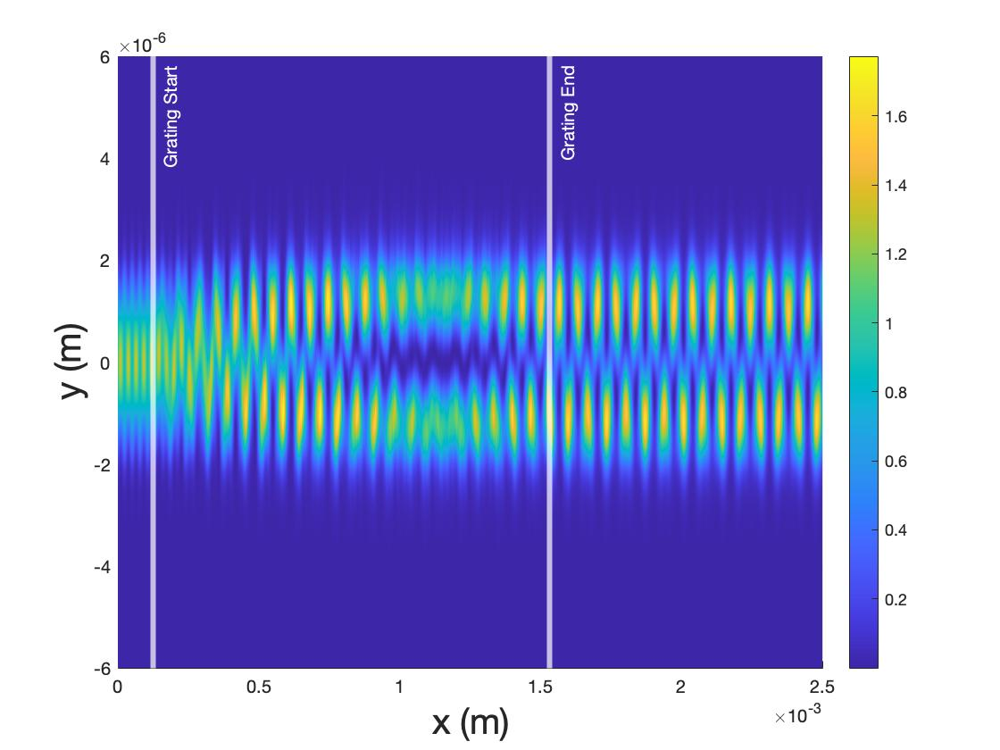
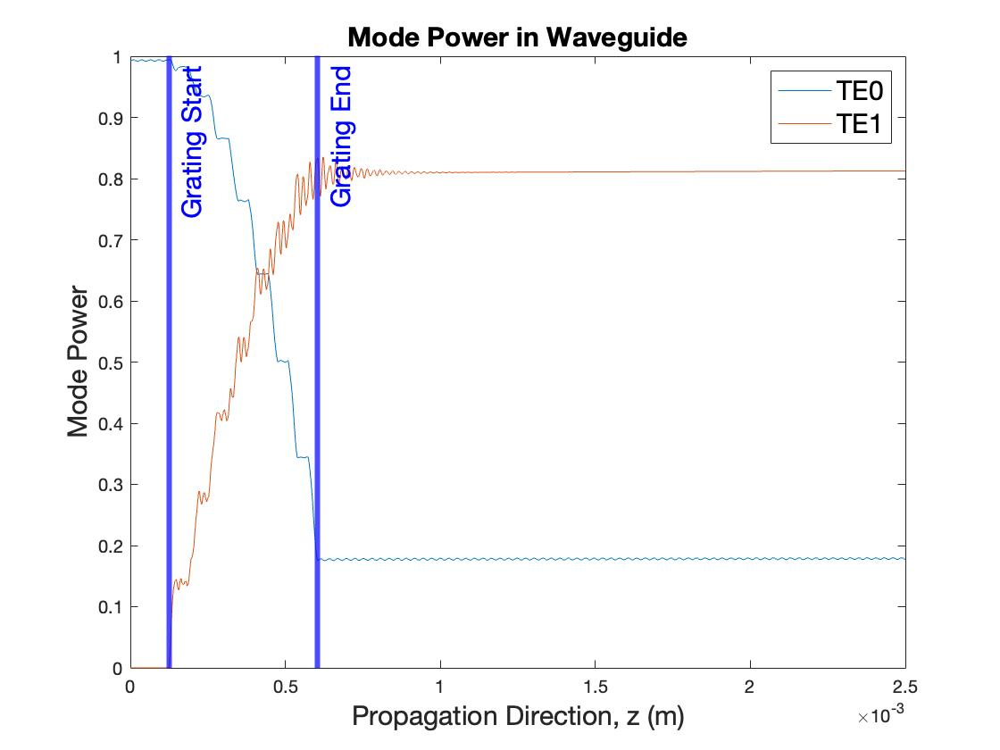

# TE0-TE1-Mode-Converter-BPM
 
## Contents
- get_modes.m: Computes the TE0/TE1 modes in the 2D slab waveguide using the effective-index method.
- input_WG.m: Computes the resultant field at the output port of the SiO2/Al2O3 slab waveguide with no perturbations.
- single_simulation.m: This is the main simulation executable. It Computes the complex E-field profiles along the transverse and propagation directions in the periodic perturbation-based TE0/TE1 mode converter using the Beam Propagation Method based on the Crank-Nicolson Scheme. The overlap integral of the propagating field with the TE0/TE1 are computed at every z-step to monitor the modal powers. The simulation parameters like the grating periodicity, grating tooth width, and waveguide length can be tuned. 

## Results
 

